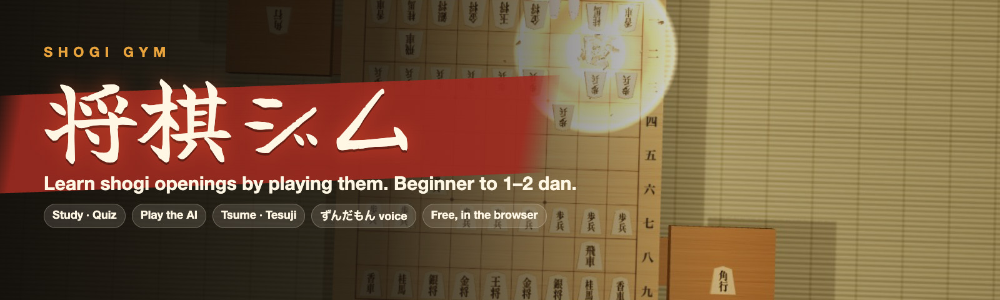

<p align="center"></p>

# Shogi Gym 将棋ジム · v1.0.0

**Play it: [hamproductions.github.io/shogilab](https://hamproductions.github.io/shogilab/)**

A free shogi training gym in the browser. Learn openings with study and quiz modes, keep them with spaced review, sharpen tactics with tsume and tesuji drills, play the AI and analyze your games. Everything runs locally, with the YaneuraOu engine compiled to WebAssembly.

<p align="center"></p>

<p align="center"><a href=".github/media/reel.mp4">Watch the 60 fps version</a></p>

The opening library covers the main strategies for beginners up to amateur 1–2 dan: pick your main (四間飛車, 中飛車, 居飛車, 矢倉…) and learn it against what your opponent plays.

The whole app is one screen: a 3D board in a tatami room or a home dining room (or a flat 2D, diagram or broadcast board), a mode rail on the left, and tool panels beside the board. On phones the board and panel share the screen. English and Japanese throughout, installable as a PWA.

## Features

- **定跡 Openings**: 110 lessons across 85 matchups for every main strategy, plus castle-breaking (囲い崩し) and sabaki (捌き) techniques, every move taken from a cited source.
  - **Study mode** shows each move with its reason and plays the opponent's reply on your cue.
  - **Quiz mode** asks you to find the moves.
  - A wrong move is graded (Good, Inaccuracy, Mistake, Blunder…), the punishing line plays out on the board, and you are asked to go back and try again.
  - A Lesson map shows every branch of the line.
- **復習 Review**: spaced repetition per position (4 h, 1 d, 3 d, 1 w and longer; a miss starts the position over). Mistakes from your own games are added automatically.
- **詰将棋 Tsume**: 1手詰 to 7手詰 plus a mixed set. Hints are staged, a King escape overlay is optional, and a solve only counts when it was found without help.
- **手筋 Tesuji**: 377 drills where the move to find is a named tesuji (叩きの歩, 突き捨ての歩, 焦点の歩, 垂れ歩, 底歩, 頭金, 両取り, ふんどしの桂, 王手飛車取り …), mined from the book lines and tsume by `scripts/mine-tesuji.ts`, each citing its source position. Plus four hand-entered pawn-tesuji lessons from shogi-rule.com's diagrams. While you play or analyze, a tesuji in the game is named on the board and tagged in the move list.
- **対局 Play AI**: four strengths. You can choose the AI's strategy (居飛車穴熊, 棒銀, 舟囲い急戦, 左美濃, 相振り飛車 and more); the AI follows that setup's book lines, then thinks for itself.
  - 待った take-back, resign, and a 王手 warning.
  - A coach comments on each of your moves.
  - Saved positions survive a reload.
- **検討 Analyze**:
  - Import KIF, KI2, CSA, JKF, USI, SFEN or USEN; Shift_JIS files work, and player names, comments and the result are shown.
  - Rate every move, with an eval graph you can click.
  - A variation tree (変化): step back anywhere and play a different move for either side.
  - Save games to in-app slots, or copy them as KIF with the variations included.
- **Formation display**: the strategy and castle of both sides (四間飛車, 本美濃, 穴熊, ミレニアム…) appear beside the board, with a short banner when one is completed.
- **Players at the table**: two seated characters move every piece by hand (reach, grip, carry, press), lean in for far squares and bow at the start. A dev-only `/dev/hands` page steps through every hand motion frame by frame.
- **Power mode** (optional): sparks, shockwaves and light beams on captures, a dimmed room with a red beam for 王手, and a 詰み finale after which the loser flips the table.
- **Zundamon voice** (VOICEVOX:ずんだもん): reads out openings, castles and tesuji as they appear, calls 王手 and 詰み, counts byoyomi, and greets you at the start and end of a game.
- **Eval bar** beside the board, steady between moves, and a take-back-and-retry prompt after a mistake.
- **Settings**: piece set (drawn letters in four brush styles, or the 菱湖 Ryoko / Brown / Light artwork sets) with a live preview, piece faces (二字 / 一字), board wood, sound, AI thinking time, number of candidate lines, AI strength, and a knowledge level ("I know the rules" / "New to shogi"), which is also asked once on the first visit.

## Run locally

```sh
bun install        # postinstall copies the engine into public/engine
bun run dev        # http://localhost:5173
bun run build      # prerendered static site in build/client/ (needs Node 22.22+)
bun run lint
node scripts/validate.mjs   # every joseki move and demo line is legal
```

## Deploy

Every push to `main` runs `.github/workflows/deploy.yml`. It validates the course data, lints, builds with `BASE_PATH=/<repo>/`, prerenders every mode and strategy page with React Router, and publishes `build/client/` to GitHub Pages. In the repository settings, set Pages → Source to "GitHub Actions" once.

The engine needs `SharedArrayBuffer`, which requires cross-origin isolation (`Cross-Origin-Opener-Policy: same-origin` and `Cross-Origin-Embedder-Policy: require-corp`).

- **GitHub Pages** cannot send these headers. `public/coi-sw.js` is a small service worker that adds them on the client, and the page reloads once the first time it installs.
- **Other hosts:** Netlify and Cloudflare Pages read `public/_headers`, and Vercel reads `vercel.json`.
- **Without isolation**, lessons, review and tsume still work, but the AI features are disabled.

## Data scripts

```sh
node scripts/build-courses.mjs          # scripts/courses/*.mjs -> src/data/joseki/*.json
bun scripts/mine-tesuji.ts              # rebuild src/data/tesuji-drills.json from the courses and tsume
node scripts/validate.mjs               # legality check of every course
node scripts/solve-tsume.mjs 5 400 500  # solve data/tsume-raw/mate5.sfen with the engine
node scripts/verify-tsume.mjs --prune   # keep only strict check-only mates
bun scripts/stats/build.ts --floodgate 2025 --aoba 4 --min 10   # opening statistics -> public/book/
```

`scripts/stats/build.ts` builds the "Played in engine games" table in the What next tab. It streams the newest `--aoba` AobaZero self-play archives (about 10,000 games and 120 MB each) straight from Google Drive through `xz` without writing them to disk (a dropped connection only cuts that file short; the games read so far still count), downloads each Floodgate year in `--floodgate` to `.cache/stats/` (7z needs a seekable file; downloads resume after a dropped connection) and streams it through `bsdtar` without unpacking it, replays the first `--ply` (30) moves of every game that starts from the normal position and has a result, and counts each (position, move) with sente wins, gote wins and draws. Positions seen in at least `--min` games are kept with up to `--moves` (10) moves each, the YaneuraOu new_petabook best move and eval are merged in, and the result is written as 256 JSON shards keyed by a hash of the position (`src/app/lib/stats.ts` has the same hash). Archives are deleted after aggregation unless `--keep` is passed; a Floodgate year needs about 350 MB of free disk while it is processed. The YaneuraOu book (76 MB) is fetched the same way. To scale up, add years (`--floodgate 2023,2024,2025`) and files (`--aoba 20`), and raise `--min` to keep the output small.

Each course records its source in its `source` field.

## Sources and licenses

This app is GPL-3.0-or-later.

| Part | Source | License |
|---|---|---|
| Engine | YaneuraOu, WASM build `@mizarjp/yaneuraou.k-p` (github.com/mizar/YaneuraOu.wasm) | GPL-3.0 |
| Engine (optional) | YaneuraOu NNUE (HalfKP 256x2-32-32), WASM build `@mizarjp/yaneuraou.halfkp.noeval` (github.com/mizar/YaneuraOu.wasm); no evaluation file is bundled, the user loads their own nn.bin | GPL-3.0 |
| Engine (optional) | Fairy-Stockfish, WASM build `fairy-stockfish-nnue.wasm` (github.com/fairy-stockfish/fairy-stockfish.wasm) | GPL-3.0 |
| Rules, notation, kifu I/O | tsshogi (github.com/sunfish-shogi/tsshogi) | MIT |
| 3D rendering | three.js | MIT |
| Room panoramas (`public/sky/ninomaru_teien.jpg`, `residential_garden.jpg`) | Poly Haven HDRIs "Ninomaru Teien" (Greg Zaal) and "Residential Garden" (Greg Zaal, Rico Cilliers), tonemapped JPGs downscaled to 4096 px (polyhaven.com) | CC0 1.0 |
| VRM loading | @pixiv/three-vrm (github.com/pixiv/three-vrm) | MIT |
| Voice clips (`public/voice/zundamon/`) | VOICEVOX:ずんだもん, recorded offline with the VOICEVOX engine by `scripts/voice/build.ts` (opening, castle and tesuji names, 王手/詰み, byoyomi count) | VOICEVOX ずんだもん音源利用規約 (zunko.jp/con_ongen_kiyaku.html): free use with the credit 「VOICEVOX:ずんだもん」 |
| Hand poses (`src/rendering/avatars/handMotion.json`) | Finger rotations baked offline by `scripts/mocap/` with MediaPipe Hand Landmarker (Apache-2.0) and Kalidokit (MIT) from landmarks of the Japan Shogi Association 手つき videos; only derived joint angles are shipped, no video | Derived data |
| Seated players (`public/avatars/sendagaya-shino.vrm`, `sakurada-fumiriya.vrm`) | VRoid Studio β sample models "Sendagaya Shino" and "Sakurada Fumiriya" by pixiv Inc. (vroid.pixiv.help/hc/en-us/articles/360013482714 and /360014788554 state CC0; conditions overview at /4402614652569; VRM files via github.com/madjin/vrm-samples; VRM meta: licenseName CC0, allowedUserName Everyone, commercialUssageName Allow); textures downscaled to 1024 px and thumbnails shrunk for size | CC0 1.0 |
| Joseki courses in `vendor/shiryu-joseki` | github.com/Shiryu181/shogi-joseki (commit in `vendor/shiryu-joseki/SOURCE_COMMIT`, re-vendored with `node scripts/build-courses.mjs --vendor <checkout> <commit>`), lines from shogilounge.com, hibitonshi.com, shogi-joutatsu.com, shogi-rule.com and ameblo.jp shogi blogs, as cited in each course's `source` | GPL-3.0 |
| 将棋ルール.com courses (`shogirule--*`) | Move sequences from the game files published at shogi-rule.com/joseki_index/. The closing summaries are written here from the moves and final position; no text from the site is reproduced, only its one-word evaluation (互角/先手優勢/後手優勢) is cited | Attribution; moves are game records |
| 角交換四間飛車 | hibitonshi.com/kakukoukan-shiken/ | Moves and notes adapted from the article |
| ミレニアム | shogijam.com, "四間飛車対ミレニアムの激しい定跡" game file | Attribution; moves are a game record |
| 相振り飛車 | thirdfilerook.jp, "相振り飛車の基礎知識 三間飛車VS四間飛車とは" | Attribution |
| 藤井システム, 左美濃, 囲い崩し diagrams | Wikipedia (en "Fujii System"; ja 左美濃, 美濃囲い, 舟囲い) | CC BY-SA |
| Opening statistics, AobaZero (`public/book/`) | Self-play game records of AobaZero (github.com/kobanium/aobazero; archives linked from www.yss-aya.com/aobazero/), aggregated to per-position move counts and results. These are training games, whose first 30 moves include deliberate exploration noise, so rare moves there can be weaker than engine play | Public domain (the README says everything except the aobaz engine is public domain) |
| Opening statistics, Floodgate (`public/book/`) | Floodgate computer-shogi server game archives (wdoor.c.u-tokyo.ac.jp/shogi/), used only as aggregated move counts and results; no game record, player name or rating is shipped | No license stated; aggregate counts only |
| Engine book move (`public/book/`) | YaneuraOu new_petabook "新ペタショック定跡 233万局面" (github.com/yaneurao/YaneuraOu/releases/tag/new_petabook233), best move and eval for positions in the statistics | MIT |
| Tsume problems | YaneuraOu 5M mate-problem set (yaneuraou.yaneu.com/2020/12/25/christmas-present/), solutions computed and re-verified here | None claimed |
| Move-label thresholds | chess.com expected-points model | n/a |
| Review intervals | Chessable MoveTrainer schedule | n/a |
| Fonts | Shippori Mincho B1, Zen Kaku Gothic New, Yuji Syuku, Yuji Boku, Zen Antique (via Fontsource) | OFL-1.1 |
| Piece set 菱湖 Ryoko (`assets/pieces/ryoko_1kanji`) | Ryoko_1Kanji by nexxogen, from lishogi (github.com/WandererXII/lishogi) | CC BY-SA 4.0 |
| Piece sets Brown / Light (`assets/pieces/kanji_brown`, `kanji_light`) | kanji_brown and kanji_light by Ka-hu, from lishogi | CC BY 4.0 |
